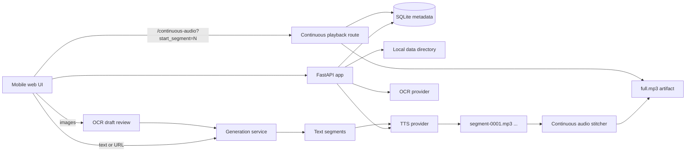

# Readvox

Readvox is a local-first, mobile-friendly web app for turning long text, article URLs, and reviewed OCR drafts into streamed text-to-speech audio. It is designed for personal use on a trusted machine: run it on localhost, optionally expose it through a private HTTPS proxy, and keep the generated audio, source text, OCR images, and playback progress in local storage.

The app focuses on long-form reading. It generates audio incrementally so playback can begin before the whole article is complete, then stitches completed segment audio into a continuous playback stream so mobile browsers do not have to switch audio files while the page is in the background.

## Features

- Generate speech from pasted text.
- Fetch and extract simple HTML article URLs.
- Upload or capture page images, review OCR output, then generate audio from the reviewed text.
- Choose named, saved voice profiles with catalog voice, language, speed, instructions, and cached previews.
- Edit profiles in-app or at `/voice-sample`; preview unsaved changes and save without losing input drafts.
- Play long articles through one continuous audio endpoint backed by incrementally stitched MP3 segments.
- Track segment-based progress and keep the currently read text highlighted during continuous playback.
- Resume and delete History entries, including cached audio and linked OCR source images.
- Store playback telemetry locally in SQLite for debugging mobile/background playback failures.
- Run with deterministic fake providers for tests and local UI checks, or Qwen providers for real TTS/OCR.

## How It Works



The database owns metadata and relationships. The filesystem owns bytes:

- SQLite: generations, text segments, audio segment metadata, continuous audio artifact metadata, OCR drafts/images, voice preferences, named voice profiles, and playback telemetry.
- `data/audio/<generation_id>/`: generated segment MP3s plus `full.mp3`.
- `data/images/<ocr_draft_id>/`: stored source images for OCR drafts.

For the exact current database shape, see [docs/schema.sql](docs/schema.sql). For relationship notes and cleanup semantics, see [docs/data-model.md](docs/data-model.md). For module boundaries and future development guidance, see [docs/architecture.md](docs/architecture.md).

## Quick Start

For usable speech and the profile editor, configure Qwen and populate its built-in voices. Copy the environment example only if `.envrc.local` does not already exist:

```bash
python -m venv .venv
.venv/bin/pip install -e ".[dev]"
cp setup/envrc.local.example .envrc.local
chmod 0600 .envrc.local
```

Edit `.envrc.local` to set `DASHSCOPE_API_KEY`. The example selects `TTS_PROVIDER=qwen`, `OCR_PROVIDER=qwen`, and `TTS_MODEL=qwen3-tts-instruct-flash-realtime`. Set `TTS_DATA_DIR` to your checkout’s data directory if it is not `/home/mohan/tts/data`. Keep the file private.

```bash
set -a
source .envrc.local
set +a
.venv/bin/python scripts/populate_voice_catalog.py --provider qwen --check
.venv/bin/python scripts/populate_voice_catalog.py --provider qwen
.venv/bin/uvicorn tts_app.api:create_app --factory --host 127.0.0.1 --port 8001
```

Catalog population is offline and requires no credentials. Open `http://127.0.0.1:8001`, choose a saved profile, paste text, and generate audio. Each catalog voice owns its model and supported languages; profiles hold a voice selection and reading settings. Use **Edit** to preview settings and **Save As…** to create another profile. Previews and generation make paid provider requests.

For existing cloned voices or creating a new one, see [Creating and reusing cloned voices](docs/cloned-voices.md). Provider settings, storage paths, and pricing notes are in [Configuration](docs/configuration.md).

## Local Development

Run with deterministic fake providers and isolated development storage:

```bash
env -u TTS_DB_PATH -u TTS_AUDIO_DIR -u TTS_IMAGE_DIR \
TTS_DATA_DIR=/tmp/readvox-dev TTS_PROVIDER=fake OCR_PROVIDER=fake \
.venv/bin/uvicorn tts_app.api:create_app \
  --factory \
  --reload \
  --reload-dir src \
  --host 127.0.0.1 \
  --port 8001 \
  --log-level info
```

Fake providers make no network calls and produce deterministic test output, not playable speech. Fresh storage has no catalog or profiles, so the profile editor starts empty. Automated tests supply their own fake catalog fixtures; use the Qwen setup above for an interactive speech workflow.

Run checks before claiming work is complete:

```bash
.venv/bin/pytest -q
npm run check:js
npm run lint:js
npm run test:js
```

## Deployment And Operations

The intended deployment is still local-first:

- Bind Readvox to `127.0.0.1:8001`.
- Put a private HTTPS proxy in front only for trusted devices.
- Do not expose the app publicly; URL generation lets users ask the host to fetch arbitrary reachable HTTP(S) URLs.

Systemd deployment files live under `setup/`, and the deployment runbook is [docs/deployment.md](docs/deployment.md). Logging and manual verification notes are in [docs/operations.md](docs/operations.md).

## Project Map

- `src/tts_app/api.py`: FastAPI app factory and shared top-level API routes.
- `src/tts_app/routes/`: feature route groups such as playback and OCR.
- `src/tts_app/storage.py`: SQLite schema, migrations, and persistence operations.
- `src/tts_app/generation.py`: text segmentation, provider streaming, audio caching, and duration backfill.
- `src/tts_app/continuous_audio.py`: stitched generation-level audio artifact builder.
- `src/tts_app/providers/`: TTS provider interface, fake provider, and Qwen realtime implementation.
- `src/tts_app/ocr_providers/`: OCR provider interface, fake provider, and Qwen OCR implementation.
- `src/tts_app/static/`: framework-free frontend modules.
- `tests/`: API, storage, generation, provider, OCR, frontend static, and Vitest coverage.

## Further Reading

- [Architecture](docs/architecture.md)
- [Data model](docs/data-model.md)
- [Current SQLite schema](docs/schema.sql)
- [Configuration and providers](docs/configuration.md)
- [Deployment](docs/deployment.md)
- [Operations](docs/operations.md)
