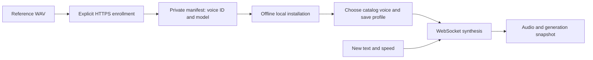

# Creating and reusing cloned voices

Enroll a reference recording once, save the returned **voice ID and exact target model**, then reuse that pair for new speech. **Kai Narrator, Vivian Narrator, Bellona Narrator and Neil Narrator already exist: importing or installing them makes no enrollment request.**

The maintained entry point is [`scripts/voices.py`](../scripts/voices.py). Its commands keep private workshop artifacts separate from production History. Run them from the repository root with the existing virtual environment. `--check` validates locally and reports intended work without network calls or file writes; omit it only when ready to perform that command.

## Three API boundaries

| API | Operations | Result |
| --- | --- | --- |
| Qwen HTTPS customization | `action=create` uploads a reference; `action=list` finds existing enrollments | A reusable cloud voice ID bound to a target model |
| Qwen realtime WebSocket | Synthesize new text with the saved voice/model pair | Streamed audio; no repeat reference upload |
| Local Readvox HTTP | Save/select a profile, preview it, or generate Text/URL/Image audio | Local settings and generation History |



Readvox reads `QWEN_API_KEY` or `DASHSCOPE_API_KEY` from the operator/server environment. Keep enrollment and synthesis in the same provider account and region. The enrollment adapter currently accepts only `dashscope-intl.aliyuncs.com`, `dashscope.aliyuncs.com`, and `dashscope-us.aliyuncs.com`; workspace-specific domains are not implemented. The verified international endpoints are:

```text
https://dashscope-intl.aliyuncs.com/api/v1/services/audio/tts/customization
wss://dashscope-intl.aliyuncs.com/api-ws/v1/realtime
```

The HTTPS endpoint is derived from the hostname in `QWEN_REALTIME_URL`. See the existing [Qwen voice cloning HTTP API](https://www.alibabacloud.com/help/en/model-studio/voice-clone-design-http-api) for the provider protocol.

## Enroll a supplied recording

Use an English reference recording whose voice and delivery you want to reuse. The local adapter accepts complete mono 16-bit WAV, at least 24 kHz, 3–60 seconds, and at most 10 MiB. This phase supports English enrollment only. Keep the exact WAV and whatever source model, voice, speed, text and instructions are actually known; a supplied recording does not need invented preset provenance.

Load credentials locally, then validate and enroll a new revision:

```bash
set -a
source .envrc.local
set +a
.venv/bin/python scripts/voices.py enroll --reference selected.wav --name "Kai Narrator v2" --key readvox-kai-v2 --model qwen3-tts-vc-realtime-2026-01-15 --speed 1 --output data/voice-workshop/kai-v2 --check
.venv/bin/python scripts/voices.py enroll --reference selected.wav --name "Kai Narrator v2" --key readvox-kai-v2 --model qwen3-tts-vc-realtime-2026-01-15 --speed 1 --output data/voice-workshop/kai-v2
```

Choose a new output directory; accidental reuse is refused. The name is a local display label, the stable key identifies this enrollment revision, and the returned cloud ID identifies the provider resource. A new recording/enrollment gets a new key. Renaming a personal profile or changing its speed needs no new enrollment. Catalog voice labels are separate from profile names; profile names must be unique when you save reading settings.

[`QwenEnrollment`](../src/tts_app/providers/qwen_enrollment.py) makes one audio-only HTTPS create request, using `Authorization: Bearer <API key>`:

```json
{
  "model": "qwen-voice-enrollment",
  "input": {
    "action": "create",
    "target_model": "qwen3-tts-vc-realtime-2026-01-15",
    "preferred_name": "readvoxkai123456",
    "language": "en",
    "audio": {"data": "data:audio/wav;base64,<encoded reference WAV>"}
  }
}
```

`qwen-voice-enrollment` selects the enrollment service; `target_model` selects the later synthesis model. The tool generates a readable short `preferred_name` with a uniqueness suffix, writes an `enrolling` state before calling Qwen, and saves `output.voice`, `output.target_model`, request ID and any reported fallback fields before any synthesis. It never automatically repeats an uncertain create request.

Our original transcript-bearing attempt returned HTTP 400, `Input 'text' is invalid`; audio-only enrollment succeeded. The maintained adapter preserves that working audio-only payload. No fallback-quality flag was reported for the four approved enrollments; omission is not an independent quality measurement.

### Optional generated candidates

A supplied WAV is sufficient. To generate new references, use an independent UTF-8 text file and an explicit voice/speed matrix:

```bash
.venv/bin/python scripts/voices.py candidates --text reference.txt --voices Kai Vivian Bellona Neil --speeds 1 1.1 1.25 --output data/voice-workshop/candidates --check
```

Omitting `--check` makes the displayed TTS requests. The default source model is `qwen3-tts-instruct-flash-realtime`, with the app's audiobook instructions saved explicitly in each sample's settings. `--model`, `--language` and `--instructions <UTF-8-file>` configure new candidates. For a selected completed sample, add `--candidate-manifest <manifest.json> --sample <number>` to `enroll`; the tool verifies exact WAV identity and retains source settings/text provenance. Chinese candidates cannot be handed to this English-only enrollment workflow. The [experiment notes](qwen-session-experiment.md) retain historical gallery commands; existing clones do not require that gallery to be recreated.

## Compare, inspect and accept

Evaluate new clones on unfamiliar passages at the intended synthesis speeds. `passages/` contains ordered UTF-8 `.txt` files, each with 1–2000 characters; a single text file also works. Every passage is a separate synthesis request:

```bash
.venv/bin/python scripts/voices.py compare --manifest data/voice-workshop/kai-v2/manifest.json --passages passages/ --speeds 1 1.1 1.25 --check
.venv/bin/python scripts/voices.py compare --manifest data/voice-workshop/kai-v2/manifest.json --passages passages/ --speeds 1 1.1 1.25
.venv/bin/python scripts/voices.py inspect --manifest data/voice-workshop/kai-v2/manifest.json
```

`compare` uses the existing enrollment with empty instructions; it never enrolls. An optional `--control-manifest <candidate-manifest> --control-sample <number>` adds the original candidate configuration, preserving its model, voice, speed and instructions. Those labels describe two complete configurations; equal numeric speeds across models need not sound equal. `--output <new-directory>` creates a separate comparison run owning copies of its referenced assets.

Listen to `report.html` in the run directory. It uses relative audio links, accessible controls, measured passage starts and explicit incomplete/failed states, without production APIs. Optionally serve that directory locally:

```bash
python -m http.server --bind 127.0.0.1 --directory data/voice-workshop/kai-v2
```

After listening, explicitly accept a completed comparison at a tested speed and install it offline:

```bash
.venv/bin/python scripts/voices.py install --manifest data/voice-workshop/kai-v2/manifest.json --accept readvox-kai-v2 --speed 1 --check
.venv/bin/python scripts/voices.py install --manifest data/voice-workshop/kai-v2/manifest.json --accept readvox-kai-v2 --speed 1
```

Installation records acceptance, copies reference assets and the source manifest into durable storage, and adds a backend-managed voice to the SQLite catalog. It never creates or updates profiles. A speed without a completed matching cloned comparison is rejected; accepted reference/evaluation speeds remain provenance rather than active profile defaults in the voice row. Existing keys or provider identities with conflicting definitions are rejected; repeated installation of the same definition is idempotent. Use the [deployment sequence](../setup/README.md#unified-voice-catalog-rollout) before updating the running app.

## Recover interrupted work

For candidates or comparisons, repeat the original inputs with `--resume <manifest.json>`. Resume verifies input identity, keeps completed audio, and makes only the remaining synthesis requests. A comparison example is:

```bash
.venv/bin/python scripts/voices.py compare --resume data/voice-workshop/kai-v2/manifest.json --passages passages/ --speeds 1 1.1 1.25 --check
```

Inspect enrollment state locally first. If it is `enrolling` or `uncertain`, use explicit cloud lookup rather than issuing another create:

```bash
.venv/bin/python scripts/voices.py inspect --manifest data/voice-workshop/kai-v2/manifest.json
.venv/bin/python scripts/voices.py enroll --resume data/voice-workshop/kai-v2/manifest.json --lookup --page-index 0
```

Lookup sends `{"model":"qwen-voice-enrollment","input":{"action":"list","page_index":0,"page_size":100}}` to the same HTTPS customization endpoint. Inspect `output.voice_list` and continue with `--page-index 1`, etc. Match the recorded preferred-name prefix and creation details before choosing the recovered ID. The adapter uses `list`, not the other enrollment family's `query_voice` operation. The [voice-list contract](https://www.alibabacloud.com/help/en/model-studio/voice-clone-design-http-api) describes its response.

Only explicit adoption writes the recovered enrollment to the local manifest:

```bash
.venv/bin/python scripts/voices.py enroll --resume data/voice-workshop/kai-v2/manifest.json --adopt-voice-id <recovered-voice-id> --page-index 0
```

Adoption verifies the ID exists in that account/region lookup page and has the saved target model. Manifests store an endpoint region and a credential fingerprint, never the credential itself. A fingerprint identifies an API key, not a permanent provider account: key rotation changes it. After independently confirming a replacement credential belongs to the same account, add `--acknowledge-credential-change` to adoption. A region mismatch is rejected. Normal `inspect` never checks cloud state, and neither app startup nor installation calls enrollment or lookup.

## Reuse the four approved voices

| Original selection | Catalog voice name | Stable key | Accepted evaluation speed |
| --- | --- | --- | --- |
| 16 / Kai | Kai Narrator | `readvox-kai-v1` | 1.0× |
| 11 / Vivian | Vivian Narrator | `readvox-vivian-v1` | 1.1× |
| 6 / Bellona | Bellona Narrator | `readvox-bellona-v1` | 1.25× |
| 1 / Neil | Neil Narrator | `readvox-neil-v1` | 1.0× |

Their exact cloud IDs and original recordings remain private in:

```text
src/tts_app/static/clone-lab-data/20260913T043114Z-0f3d936a/manifest.json
```

They support English and `qwen3-tts-vc-realtime-2026-01-15`, with instructions disabled. Each entry's `enrollment.voice` and `enrollment.target_model` identify the reusable voice/model pair. Selected speeds record accepted evaluations; the old top-level `settings.voice`/`settings.speed` describe inherited source defaults. Choose speed when saving a profile. Existing installed profiles retain their chosen 1×, 1.1×, 1.25× and 1× settings during migration.

The exact historical manifest can be installed directly, with no enrollment or synthesis:

```bash
.venv/bin/python scripts/voices.py install --manifest src/tts_app/static/clone-lab-data/20260913T043114Z-0f3d936a/manifest.json --check
.venv/bin/python scripts/voices.py install --manifest src/tts_app/static/clone-lab-data/20260913T043114Z-0f3d936a/manifest.json
```

Alternatively, convert it into a portable version-1 workshop run, copying reference and comparison bytes without regeneration:

```bash
.venv/bin/python scripts/voices.py import-legacy --manifest src/tts_app/static/clone-lab-data/20260913T043114Z-0f3d936a/manifest.json --output data/voice-workshop/approved-v1 --check
.venv/bin/python scripts/voices.py import-legacy --manifest src/tts_app/static/clone-lab-data/20260913T043114Z-0f3d936a/manifest.json --output data/voice-workshop/approved-v1
.venv/bin/python scripts/voices.py install --manifest data/voice-workshop/approved-v1/manifest.json --check
.venv/bin/python scripts/voices.py install --manifest data/voice-workshop/approved-v1/manifest.json
```

Implicit historical acceptance requires the exact approved manifest fingerprint and all four original WAV fingerprints. Changing an ID, recording, or even manifest formatting removes that exception. Edited artifacts may still be imported, but require listening and explicit `--accept` at a completed tested speed. Choose one installation source for a key and retain it for repeat installations; conflicting definitions are not silently replaced.

## Use the catalog voices

For built-ins on empty storage, run `.venv/bin/python scripts/populate_voice_catalog.py --provider qwen --check`, then repeat without `--check`. This is an offline population command; it neither enrolls nor synthesizes. Update the reviewed Qwen source before rerunning it to introduce newly published presets. Existing accepted clone bundles still use `scripts/voices.py install`, independently of built-in population.

Open **Edit** from Generate or visit `/voice-sample`, choose a language and a compatible catalog voice, then set speed, then use **Save As…** with a unique name. On a clean install this creates your first profile for that clone; installation itself adds no clone profiles. **Save** updates the selected profile. All profiles, including the four originals preserved from an older installation, can be edited or deleted. Deleting one leaves the catalog voice and enrollment available for another profile and does not delete reference files or History. Restarting or reinstalling never recreates deleted profiles.

The catalog is read-only in the app. Built-in and cloned voices use the same selector, with choices filtered by language and provider labels displayed. Each voice owns its model; profiles store no model. Clone instructions remain empty and unavailable. Text, URL and reviewed English Image drafts can use clone profiles; Chinese Image drafts retain their separate language requirement. Changing profile names or speeds reuses the enrollment without another enrollment request.

| Local API | Role |
| --- | --- |
| `GET /api/voices` | Read catalog identity, friendly name, availability, one model and language/instruction capabilities; private provenance is omitted |
| `/api/voice-profiles` | List/create named settings using `voice_id` and reading settings; `/{id}` reads, updates or deletes any profile |
| `POST /api/voice-sample/instruction` | Preview `voice_id` and explicit reading settings without History; legacy raw `voice` remains compatible |
| `POST /api/generations/text` or `/api/generations/url` | Generate using a selected `profile_id` |
| `POST /api/ocr-drafts/{draft_id}/generation` | Generate from a reviewed draft with a compatible profile |

Profile writes, previews and profile-based generation admit only catalog voices supported by the configured provider. A voice from another provider or an unavailable legacy identity produces a validation error; there is no provider substitution. `/api/voice-sample/options` includes `voice_catalog` and `default_voice_id`. Each profile-based generation snapshots provider, profile name/ID, friendly voice name, catalog/raw voice IDs, model, language, speed and instructions; later profile changes do not alter existing History or audio. History shows and searches the saved friendly labels. Installing clones does not change the global `TTS_MODEL=qwen3-tts-instruct-flash-realtime` default.

At the provider boundary, [`QwenTTSProvider`](../src/tts_app/providers/qwen.py) uses the saved target model in the WebSocket URL, sends `session.update` with the enrolled `voice`, `language_type`, `speech_rate`, format and sample rate, then sends `input_text_buffer.append`, `input_text_buffer.commit` and `session.finish`. Empty instructions are omitted. It collects `response.audio.delta` bytes until `response.done` reports completion and nonempty audio. `session.finish` alone does not establish success. Workshop commands request PCM and write WAV headers; each passage is independent. See [Qwen client events](https://www.alibabacloud.com/help/en/model-studio/qwen-tts-realtime-client-events) and [server events](https://www.alibabacloud.com/help/en/model-studio/qwen-tts-realtime-server-events).

## Keep durable backups

Back up the SQLite database, all `data/voices/` reference bundles/source manifests, and complete private workshop/legacy run directories together. Version-1 asset paths are relative to their manifest; the loader verifies SHA-256 values and refuses missing or changed assets. Installed bundle `source.json` records the input manifest, but comparison assets still belong to the original workshop/legacy run and must be backed up there.

SQLite is authoritative for the voice catalog and editable profiles. Startup reads installed catalog entries; explicit `scripts/populate_voice_catalog.py` runs synchronize built-in definitions; it does not scan directories, import arbitrary manifests, or contact enrollment APIs. `data/voices/` owns durable reference bytes outside the preview cache. Clearing samples, deleting a profile, or deleting History does not remove catalog voices or their references. Workshop artifacts have no automatic cleanup. Preserve retained staging/bundle directories after installation failures for diagnosis; installation never deletes originals. Keep all these private artifacts and credentials out of Git. A clean checkout contains neither the enrollments nor the recordings, and deleting local files does not delete a cloud enrollment.
