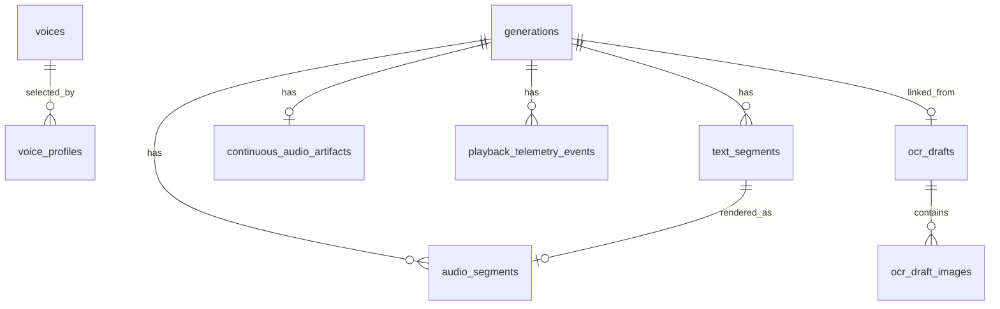

# Data Model

Readvox stores metadata in SQLite and bytes on the filesystem. The exact schema is checked in at [schema.sql](schema.sql).

## Storage Layout

- `data/app.db`: SQLite database.
- `data/audio/<generation_id>/segment-0001.mp3`: per-segment TTS audio.
- `data/audio/<generation_id>/full.mp3`: stitched continuous playback artifact.
- `data/audio/voice-samples/<cache_key>.mp3`: derived voice sample cache files.
- `data/images/<ocr_draft_id>/<ocr_draft_image_id>/`: source images for OCR drafts.
- `data/voices/<bundle_hash>/`: durable cloned-voice reference WAVs and source manifests.

## Core Relationships

## Generations

`generations` is the durable History entry. It stores source type, title, optional URL, full source text, provider, voice, settings JSON, status, progress, and timestamps.

`text_segments` stores the ordered text chunks generated from a History entry.

`audio_segments` stores one row per completed segment audio file. Segment files remain the source of truth for generated audio bytes. `duration_ms` is populated when parseable and can be lazily backfilled for older cached MP3s.

`continuous_audio_artifacts` stores metadata for `full.mp3`, the stitched artifact used by the continuous playback endpoint.

## OCR Drafts

OCR image workflows are staged as drafts until the user creates audio:

- `ocr_drafts.combined_text` is the reviewed source of truth for audio generation.
- `ocr_draft_images.extracted_text` preserves raw per-image OCR output for retry, delete, and diagnostics.
- Linked drafts disappear from active draft-picking surfaces after audio generation and are recovered through History.
- Deleting an image History entry removes the generation, cached audio, linked OCR draft, and stored source images.

## Voice Preferences

`voice_preferences` stores the user's preferred voice per language.

Voice sample audio is cached under `data/audio/voice-samples/` by provider/model/language/voice/speed/sample-text hash. The profile editor, also available at `/voice-sample`, generates cached audio from current unsaved preview text and instructions. The legacy fixed-text sample API remains compatible. The complete sample text and configured segment boundary participate in the cache key. Text longer than the segment boundary is synthesized sequentially and concatenated into one atomic MP3 cache file; a failed or canceled segment leaves no partial cache entry. These cache files are not generation History rows and are not removed by generation deletion. `DELETE /api/voice-samples/cache`, exposed by the profile editor's Clear samples control, removes the full voice sample cache, including both fixed-text samples and instruction preview samples. Cache-clear failures are returned to the client rather than reported as successful.

## Playback Telemetry

`playback_telemetry_events` stores content-free local diagnostics for playback debugging. It may reference a generation, segment index, and audio segment id, but it must not store article text, OCR text, URL content, generated audio bytes, provider raw responses, or raw browser identifiers.

## Cleanup Semantics

- Deleting a generation cascades text/audio segment metadata, continuous artifact metadata, and playback telemetry.
- Deleting a generation removes its cached audio directory.
- Deleting an unlinked OCR draft removes its stored source image directory.
- Deleting an image generation force-deletes its linked OCR draft and image directories.

## Voice catalog and profiles

`voices` stores a stable ID/key, provider and provider voice ID, friendly name, kind, availability, one `model`, `languages_json`, `supports_instructions`, optional private `metadata_json`, and timestamps. Provider plus provider voice ID is unique. A multilingual voice has one row with multiple language codes. Profile speed, chosen language, instructions and preview text do not belong in catalog defaults.

`voice_profiles` stores ID, trimmed name, Unicode case-folded unique `name_key`, required `voice_id` foreign key, language, speed, instructions, preview text and timestamps. It contains no model. Every profile is editable/deletable; its deletion leaves the referenced voice and all independent audio/reference assets intact.

Explicit offline population synchronizes the selected provider's built-ins; normal refresh marks retired voices unavailable without deleting profiles. Clone installation writes the same catalog shape and adds durable metadata only. Exact WAVs and source manifests live below `data/voices/` and have no automatic cleanup flow. Back up SQLite, installed bundles and private workshop runs together.

Startup may seed ordinary default profiles when compatible voices first become available. Profiles are never recreated after deletion by startup, sync or installation.

Profile-based generation `settings_json` snapshots `profile_id`, `profile_name`, `voice_id`, `voice_name`, `provider`, `model`, raw `voice`, `language`, `speed`, and `instructions`. These are historical values, not live references. Catalog/model changes and profile deletion do not change active jobs or old entries. History displays saved friendly profile labels; absent historical model metadata stays unknown. Existing voice preferences remain independent.
